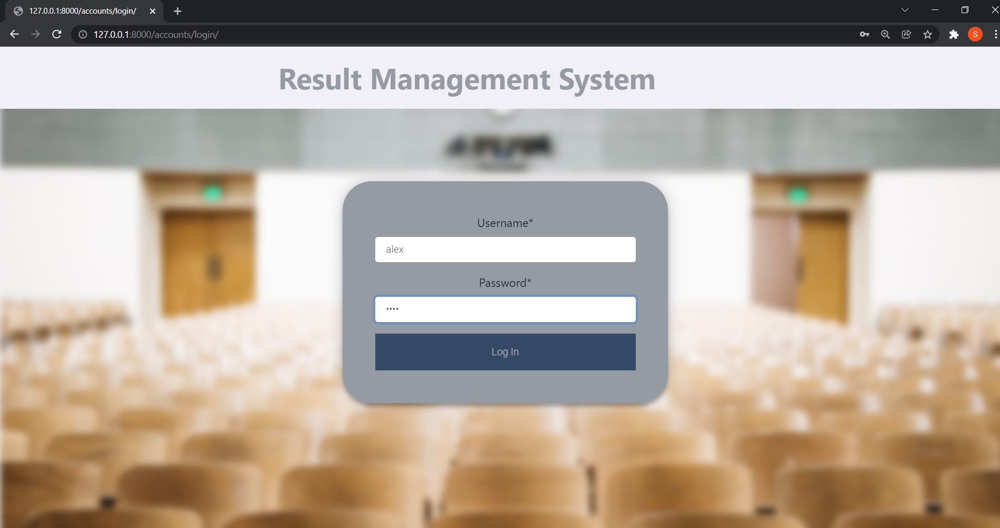

# RMSystem
## About: 
In this age of online learning, we focused on building an Online Result Management System(ORPS) using Django framework. 
It is designed for interactions between teachers and students where students can view their academic result and download 
the tabulation sheet and teachers can view, enter and edit the marks and generate the tabulation sheet.

## Features:
1.	This is a Multi User System web application where user are the admin, teachers and students.   
2.	Admin can create users and s/he can also edit user data.
3.	Admin can Add Edit and Delete Classes data.
4.	Admin user can Add New Courses in particular Department and s/he can also edit or remove course data.
5.	Admin user can Add, Edit and Delete Student data.
6.	Admin can Add, Edit and Delete Exam data.
7.	Admin can edit users’ profile details.
8.	Teacher can add and edit result data and admin can supervise them.
9.	Students can view the result data.
10. Teachers and Students can download tabulation sheet in PDF format.

## Tech Stack:
**Front-End:** HTML, CSS, Bootstrap, JavaScript\
**Database:** SQLite3\
**Back-End:** Django


## Installation:
Cmd: 
```
git clone https://github.com/baizidjilani/RMSystem.git
```
Then run the following commands:
```
cd RMSystem
pipenv install django=3.1.3
pipen shell
pip install crispy-forms=1.9.2
pip install xhtml2pdf
```
After that:
```
python manage.py makemigrations
python manage.py migrate
python manage.py runserver
```

## Screenshots:
### Login as Teacher:
```
Username: alex
Password: alex
```



### Login as Student:
```
Username: george
Password: george
```


### Login as Admin:
```
Username: admin
Password: admin
```


To create admin/superuser, run the following command:
```
python manage.py createsuperuser
```


